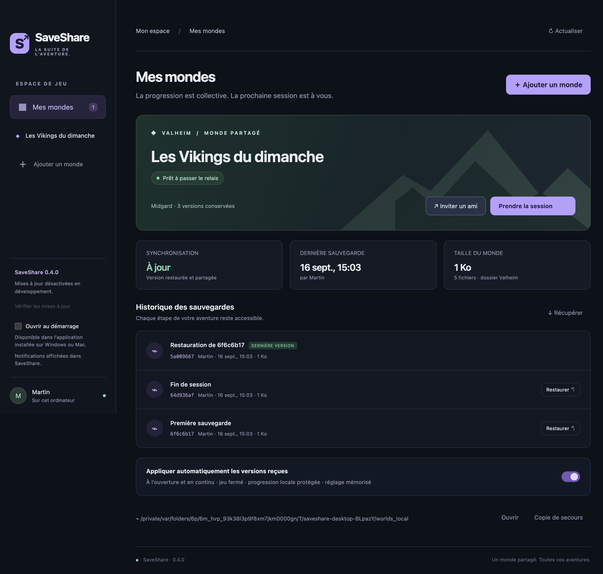
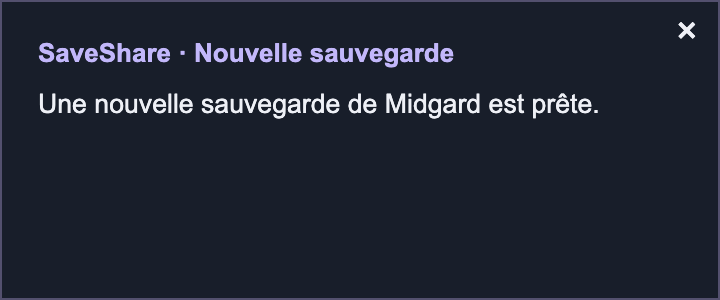

# SaveShare

**Le même monde Valheim, même quand l’hôte change.**

SaveShare est une application Windows et macOS qui partage vos sauvegardes entre amis et conserve leur historique. Vous jouez ensemble ou en solo sur le PC de l’un des membres, puis le prochain hôte reprend le monde à jour. Un serveur SaveShare central stocke les versions ; la partie Valheim reste hébergée par un joueur.

[Télécharger la dernière version](https://github.com/martineon/SaveShare/releases/latest) · [Installer le serveur](#installer-le-serveur-sur-internet) · [Utilisation entre amis](#utilisation-entre-amis)



*Capture réelle de l’application sur macOS, avec un monde de démonstration.*

## Ce que fait SaveShare

- **Synchronisation automatique** : envoi des sauvegardes stabilisées et téléchargement des nouvelles versions lorsque l’application est ouverte.
- **Passage de relais** : un seul joueur détient la session d’écriture du monde à la fois.
- **Historique façon Git** : versions datées, auteur, parent et restauration sans effacer l’historique.
- **Protection des fichiers** : vérification SHA-256, copies de secours et blocage des écrasements automatiques en cas de progression locale différente.
- **Invitations entre amis** : un code donne accès au monde sur votre propre serveur HTTPS.

## Télécharger

| Système | Installateur v0.4.0 |
| --- | --- |
| Windows x64 | [SaveShare pour Windows (.exe)](https://github.com/martineon/SaveShare/releases/download/v0.4.0/SaveShare-0.4.0-win-x64.exe) |
| Mac Apple Silicon — M1, M2, M3… | [SaveShare pour Mac ARM64 (.dmg)](https://github.com/martineon/SaveShare/releases/download/v0.4.0/SaveShare-0.4.0-mac-arm64.dmg) |
| Mac Intel | [SaveShare pour Mac Intel (.dmg)](https://github.com/martineon/SaveShare/releases/download/v0.4.0/SaveShare-0.4.0-mac-x64.dmg) |

Les installateurs sont disponibles dans les [releases GitHub](https://github.com/martineon/SaveShare/releases), avec leurs [empreintes SHA-256](https://github.com/martineon/SaveShare/releases/download/v0.4.0/SHA256SUMS.txt). Node.js n’est pas nécessaire pour utiliser l’application installée. Les exécutables ne sont pas signés/notariés ; Windows ou macOS peut afficher un avertissement ou en bloquer l’ouverture.

**À essayer d’abord avec une copie de monde.** Depuis 0.3.0, SaveShare prend en charge le **dossier complet d’un monde Valheim 1.0**, ainsi que l’ancienne paire `<monde>.db` + `<monde>.fwl`. Les personnages et les autres jeux ne sont pas pris en charge ; la compatibilité des mods n’est pas garantie. Aucun serveur public n’est fourni avec le projet.

## Mises à jour de l’application

À partir de **0.2.0**, SaveShare vérifie GitHub dix secondes après le lancement, puis toutes les six heures. Le bouton de la barre latérale permet aussi une vérification manuelle. Seules les releases publiées sans marqueur « pre-release » sont suivies ; aucun retour automatique vers une ancienne version n’est effectué.

- **Windows** : téléchargement automatique, contrôle d’intégrité, puis bouton **Redémarrer et installer**. L’installation attend que la session soit terminée, la synchronisation au repos et Valheim fermé. Une fermeture ordinaire de SaveShare ne lance pas l’installation.
- **Mac** : détection des nouvelles versions et bouton **Ouvrir le téléchargement**, puis remplacement manuel de l’application. L’installation automatique macOS exige une signature de distribution Apple, qui n’est pas configurée pour ce projet.

**Depuis 0.1.0, installez la dernière version manuellement une première fois.** Les mondes connectés, les clés et les copies de secours sont conservés dans le dossier de données utilisateur. Aucune clé d’administration du serveur ni aucun token GitHub n’est nécessaire pour télécharger les mises à jour. Le mode développement (`npm start`) ne contacte pas le serveur de mises à jour.

## Démarrage et notifications

Depuis **0.4.0**, **Ouvrir au démarrage** inscrit l’application installée à l’ouverture de votre session Windows/macOS lors de son premier lancement. Le réglage est modifiable dans la barre latérale. Les changements effectués ensuite dans le système sont respectés. Le mode développement ne modifie jamais les éléments de démarrage.

Sur Mac, placer SaveShare dans **Applications**. L’[API de démarrage Electron](https://www.electronjs.org/docs/latest/api/app#appsetloginitemsettingssettings-macos-windows) peut échouer avec une application non signée/notariée : si l’interface indique que macOS n’a pas confirmé l’activation, ajouter manuellement SaveShare dans **Réglages Système → Général → Ouverture**. Une approbation système peut aussi être nécessaire.

Au lancement, chaque monde connecté est vérifié. La dernière version est téléchargée et, si la réception automatique est activée, appliquée avec les protections habituelles. Si Valheim tourne, SaveShare attend sa fermeture. En cas de modification locale, il avertit sans écraser la progression. Sans réseau, il réessaie lors des vérifications suivantes. Aucune session d’écriture n’est prise automatiquement.

Une nouvelle version reçue déclenche une petite notification cliquable, une seule fois par version pendant l’exécution de SaveShare. Windows utilise les notifications système (selon leurs autorisations). Sur Mac, une petite fenêtre SaveShare de dix secondes est utilisée : les [notifications natives Electron](https://www.electronjs.org/docs/latest/tutorial/notifications) nécessitent une signature. Un message apparaît également dans l’application. **Quitter SaveShare arrête la synchronisation et les notifications** ; réduire sa fenêtre la laisse fonctionner.



## Lancer depuis les sources

Installer Node.js **22.12 ou supérieur**, puis :

```sh
git clone https://github.com/martineon/SaveShare.git
cd SaveShare
npm ci
npm start
```

Pour produire les installateurs sur leur OS respectif :

```sh
npm run dist:mac
npm run dist:win
```

Les fichiers sont générés dans `dist/`. Le workflow GitHub Actions teste et compile sur Windows et macOS. Les builds locaux/CI sont non signés tant que des certificats ne sont pas configurés ; ils ne constituent pas une distribution publique signée/notariée. Architecture par défaut : celle de la machine de compilation. Pour Mac Intel : `npx electron-builder --mac --x64 --publish never` ; pour Apple Silicon : `--arm64`.

### Publier une nouvelle version

Mettre à jour `version` dans `package.json` et le lockfile, ajouter `docs/releases/vX.Y.Z.md`, puis pousser le code et un tag `vX.Y.Z` correspondant. Le workflow compile Windows x64 et les deux architectures Mac, vérifie les empreintes des installateurs référencés dans `latest.yml` et `latest-mac.yml`, puis publie la release après l’envoi de tous les fichiers. Les `.zip`, `.blockmap` et métadonnées `.yml` doivent rester dans la release et conserver leurs noms d’origine : ils servent au mécanisme de mise à jour. Une release déjà publiée n’est pas écrasée.

## Installer le serveur sur Internet

Prévoir un VPS avec Docker Compose, un nom de domaine pointant vers son IP et les ports TCP 80/443 accessibles. Le serveur n’exécute pas Valheim : il stocke seulement les sauvegardes.

1. Copier `.env.example` vers `.env`.
2. Remplacer `SAVESHARE_DOMAIN` par le domaine et `SAVESHARE_ADMIN_TOKEN` par une clé aléatoire. Générateur : `node -e "console.log(require('node:crypto').randomBytes(32).toString('hex'))"`.
3. Exécuter `docker compose up -d --build`.
4. Vérifier `https://votre-domaine/health`, qui doit retourner `{"ok":true,"protocol":2}`.
5. Dans SaveShare, créer un partage avec cette URL et la clé administrateur. Les amis ont uniquement besoin du code d’invitation du monde.

Caddy termine HTTPS et gère les certificats. Le port interne 8787 n’est pas publié. Le volume Docker `saves` conserve les données ; sauvegarder ce volume indépendamment. Ne pas lancer plusieurs instances serveur sur le même stockage : les transactions sont sérialisées dans un seul processus.

### VPS avec nginx déjà installé

Utiliser `docker compose -p saveshare -f compose.vps.yaml up -d --build` à la place du compose principal. Cette variante n’installe pas Caddy : elle expose l’API uniquement sur `127.0.0.1:8787`, stocke les données dans le volume `saveshare-data` et ajoute un contrôle de santé. La clé administrateur doit être définie dans le fichier `.env` du serveur (permissions `600`).

Le fichier `deploy/nginx.conf` fournit le proxy HTTP pour `saveshare.martineon.com` ; adapter le domaine pour une autre installation. Après avoir pointé le DNS vers le VPS, installer ce site nginx, vérifier `nginx -t`, recharger nginx et utiliser Certbot pour activer HTTPS. Ne pas ouvrir le port 8787 sur Internet. La configuration autorise les fichiers jusqu’à 1 Gio et leur transfert en flux.

Pour développer en local, générer une clé puis lancer (macOS/Linux) :

```sh
export SAVESHARE_ADMIN_TOKEN='votre-cle-aleatoire-de-32-caracteres-minimum'
npm run server
```

PowerShell : `$env:SAVESHARE_ADMIN_TOKEN = 'votre-cle-aleatoire-de-32-caracteres-minimum'`, puis `npm run server`. Utiliser `http://127.0.0.1:8787` dans l’application. HTTP distant est refusé par le client. Configuration serveur : `HOST` (défaut `127.0.0.1`), `PORT` (8787), `SAVESHARE_DATA` (`./data`).

## Utilisation entre amis

1. Dans Valheim, déplacer le monde vers les sauvegardes **locales**, puis fermer le jeu. SaveShare ne doit pas concurrencer Steam Cloud sur les mêmes fichiers.
2. L’hôte crée le partage et choisit **le dossier portant le nom du monde**, à l’intérieur de `worlds_local` (pas `worlds_local` lui-même). Pour une sauvegarde antérieure à 1.0, utiliser **Ancien format : sélectionner un .fwl** ; le `.db` du même nom doit exister à côté.
3. Cliquer **Prendre la session**, puis lancer le monde dans Valheim. La première version est envoyée immédiatement. Ensuite, les changements stabilisés depuis au moins dix secondes sont détectés toutes les quinze secondes.
4. Copier l’invitation et la transmettre aux amis. Ils rejoignent le partage en sélectionnant leur dossier `worlds_local`, puis cliquent **Récupérer**, jeu fermé.
5. Les nouveaux fichiers sont téléchargés dès l’ouverture puis toutes les quinze secondes lorsque SaveShare est ouvert. **Appliquer automatiquement les versions reçues** est activé par défaut en 0.4.0 et son réglage est mémorisé par monde. Les fichiers ne sont remplacés que jeu fermé, hors session et sans progression locale non publiée. Désactiver cette option conserve le téléchargement dans le cache, avec application manuelle par **Récupérer**.
6. Avant de passer le relais : sauvegarder, quitter Valheim, puis **Terminer ma session**. La dernière sauvegarde est publiée avant de libérer le verrou. Un autre ami peut prendre la session, même pour jouer seul.

Le bouton **Prendre la session** récupère la dernière version avant d’autoriser le relais. En cas de différence locale non publiée, il bloque : **Récupérer** conserve ces fichiers dans une copie de secours avant de remplacer le monde. Le bouton **Copie de secours** ouvre la dernière copie. Les copies précédentes restent dans `backups/` du dossier de données de l’application.

Le sélecteur propose le chemin Windows `AppData/LocalLow/IronGate/Valheim/worlds_local` ou le chemin macOS Steam `Library/Application Support/IronGate/Valheim/worlds_local` sous le dossier utilisateur. Selon l’installation (notamment Mac App Store ou serveur dédié avec `-savedir`), sélectionner le chemin effectif manuellement. Les participants doivent utiliser des versions du jeu et des mods compatibles.

## Format Valheim 1.0 et migration

Le [changelog officiel Valheim](https://steamcommunity.com/app/892970/announcements/) confirme le passage à un stockage découpé en blocs. La [documentation de valheim-server-ui](https://github.com/jonasthim/valheim-server-ui/blob/claude/valheim-server-ui-config-ws1lch/docs/WORLDS.md) décrit les générations et le remplacement complet des mondes.

Un dossier courant contient `_main.N.fwl2`, `_main.N.db2`, `_main.N.chunks`, `_main.N.ok` et des fichiers `.chunk`. SaveShare conserve **tout le contenu du dossier**, avec les noms et les octets d’origine, y compris les blocs dont la génération diffère. Il attend une génération principale complète et des fichiers stables avant publication automatique. Il ne reconstruit ni ne convertit les fichiers du jeu.

- Mettre le serveur et **tous les joueurs à jour en 0.3.0 ou supérieur** avant la migration.
- Un partage existant détecte automatiquement le dossier de même nom créé par Valheim dans `worlds_local`. Ce dossier devient prioritaire sur la vieille paire laissée à côté ; le même historique et la même invitation sont conservés.
- Lors d’une récupération, la copie de secours conserve les deux dispositions si elles existent. Seule la disposition de la version reçue reste active après remplacement.
- Restaurer une version ancienne au format `.db/.fwl` reste possible ; Valheim pourra la convertir à nouveau au lancement. Les anciens clients SaveShare sont refusés dès qu’un monde a utilisé le nouveau format, même après ce retour en arrière.
- Les sauvegardes automatiques de Valheim placées **à côté** du dossier du monde ne sont pas envoyées ; SaveShare possède son propre historique.

## Versionnement et protection

- Historique linéaire de commits : identifiant, parent, date serveur, auteur, message, manifeste. Ce n’est pas un dépôt Git ; le modèle est inspiré de Git.
- Contenu adressé par SHA-256 et dédupliqué. Un commit n’est accepté que lorsque tous les fichiers de son manifeste sont présents et que son parent est la version courante.
- Session serveur de 90 secondes renouvelée toutes les 20 secondes. Une session expirée refuse toute publication. Après une coupure, les fichiers locaux restent en place ; une divergence demande une récupération explicite.
- Restauration = **nouveau commit** reprenant une ancienne version. L’historique partagé n’est jamais effacé. L’interface montre les trente versions les plus récentes ; toutes restent sur le serveur.
- Copies de secours avant remplacement, téléchargement vérifié, fichiers temporaires et journal local pour récupérer une application interrompue. Les dossiers sont remplacés entièrement, pas fusionnés : les anciennes générations et les blocs absents de la version choisie ne restent pas actifs. Les fichiers déplacés après une interruption restent récupérables dans des dossiers cachés `.saveshare-*` à côté du monde.
- Détection de processus Valheim/valheim_server avant application locale ; erreurs de détection bloquantes. Les exécutables renommés ou lancés dans un conteneur distant ne sont pas détectables : garder le jeu fermé avant récupération et prendre la session avant toute partie locale.
- La stabilité des fichiers et la présence des marqueurs ne prouvent pas leur cohérence binaire interne. Les sauvegardes ne peuvent pas être fusionnées automatiquement. La sauvegarde finale après fermeture du jeu reste le point de reprise recommandé.

## Limites de cette version

Serveur privé pour un groupe de confiance, avec clé administrateur et invitation secrète par monde. Toute personne disposant de l’invitation peut lire, publier et restaurer ce monde. Pas encore de comptes individuels, révocation d’invitation dans l’interface, quotas globaux, collecte des fichiers orphelins, pagination serveur, partage public, ni chiffrement de bout en bout. Le serveur a accès aux sauvegardes. Les secrets locaux sont dans la configuration de l’application avec permissions de fichier restreintes ; ils ne sont pas intégrés au trousseau système. Utiliser HTTPS et protéger les sauvegardes du serveur.

Maximum 1 Gio par fichier, 16 Gio et 50 000 fichiers par version de dossier ; l’historique et les copies locales croissent sans purge automatique. Les transferts sont en flux mais un fichier modifié est envoyé en entier. Les fichiers déjà présents dans la version de départ ne sont pas renvoyés. L’application doit rester ouverte et l’ordinateur éveillé pour synchroniser. Ce logiciel ne démarre pas Valheim, ne fournit pas de serveur de jeu permanent et ne gère pas les réglages réseau de la partie.

## Vérifier

```sh
npm test
npm run test:desktop
```

Tests réels sur serveur HTTP temporaire et deux dossiers de joueurs : passage de relais, téléchargement et application automatiques, restauration, modifications hors ligne, verrou expiré, contrôle du parent, authentification, corruption, journal de reprise, processus de jeu et liens symboliques. Le test de bureau lance une vraie fenêtre Electron, crée un partage via l’interface, publie, restaure et vérifie l’invitation. Il génère des captures dans `artifacts/`. Les fixtures sont synthétiques : aucun fichier Valheim existant n’est utilisé par les tests et le chargement de ces fixtures dans le jeu n’est pas validé.

Références : [guide officiel du serveur Valheim](https://www.valheimgame.com/support/a-guide-to-dedicated-servers/), [sécurité Electron](https://www.electronjs.org/docs/latest/tutorial/security), [compilation multiplateforme](https://www.electron.build/v26/docs/features/multi-platform-build/).
